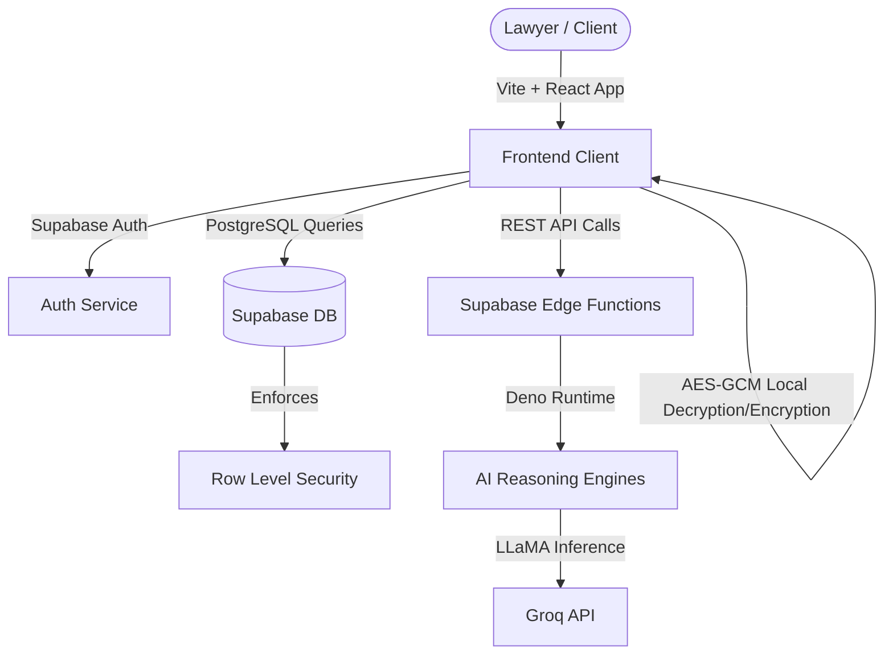

# AegisVault 🛡️⚖️

AegisVault is an enterprise-grade litigation intelligence and secure legal operations platform built specifically for Indian legal workflows. Designed to transition legal proceedings from chaotic email trails to an institutional, security-first digital workspace.

---

## Architecture Overview

AegisVault is engineered with a modern, decoupled cloud architecture designed for high scalability, zero-trust security, and precise legal reasoning.



---

## Core Features & System Capabilities

### 1. ⚖️ Legally Grounded Jurisdiction Intelligence
Unlike generic AI engines, AegisVault parses complex case summaries (e.g. matrimonial disputes, cheque bounces, criminal FIRs) and applies strict legal grounding:
- **Statutory Anchor Filters**: Anchors cases directly to the correct territorial High Courts using physical locations and cause-of-action parameters.
- **Section 142(2)(a) Compliance**: Direct implementation of Negotiable Instruments Act standards for cheque bounce matters, anchoring to the payee's home bank branch.
- **Deduplication & Calibration**: Calibrates recommendations and displays confidence intervals, refusing to hallucinate recommendations when facts are ambiguous.

### 2. 🔒 Zero-Trust Case Security & RLS
To meet strict attorney-client privilege requirements:
- **Client-Side Encryption**: Messages and sensitive case details are encrypted in-browser using **AES-GCM** prior to storage.
- **Row-Level Security (RLS)**: PostgreSQL tables are locked down with granular RLS policies matching `auth.uid()` against target lawyer and client profiles.
- **Role-Based Access**: Specialized views and dashboards for both Counsel (Lawyers) and Clients to handle secure requests and consultations.

### 3. 🧠 IPC-to-BNS Transposition
Adapts traditional Indian Penal Code (IPC) and Code of Criminal Procedure (CrPC) concepts to the newer Bharatiya Nyaya Sanhita (BNS) and Bharatiya Nagarik Suraksha Sanhita (BNSS) structures with explainable workflows.

### 4. 📈 Litigation Risk Modeling
Assesses success probabilities using structured, weighted legal scoring models. It maps evidence presence, procedural compliance, timeline consistency, and statutory notifications to output predictable metrics.

---

## Technology Stack

| Layer | Technologies | Purpose |
| --- | --- | --- |
| **Frontend** | React 19, TypeScript, Vite, TailwindCSS, Lucide Icons | Premium UI, client-side encryption, reactive dashboard |
| **Backend & Auth** | Supabase, PostgreSQL | Secure database, schema migrations, and authentication |
| **Serverless** | Supabase Edge Functions (Deno) | AI workflow execution and API integrations |
| **Inference** | LLaMA Models via Groq API | Low-latency legal analysis and transposition |
| **Testing** | Node.js Test Runner | Lightweight regression testing for jurisdiction and risk engines |

---

## Directory Structure

```text
AegisVault/
├── .github/workflows/    # CI/CD pipelines
├── frontend/             # React single-page application (Vite)
│   ├── src/
│   │   ├── components/   # Reusable UI elements (auth, modal, sidebar)
│   │   ├── hooks/        # Auth and data retrieval hooks
│   │   ├── lib/          # Supabase client config & types
│   │   └── pages/        # Main route dashboards and simulator views
├── supabase/
│   ├── functions/        # Serverless Deno Edge Functions
│   └── migrations/       # PostgreSQL DB schema, triggers, and demo seeds
├── tests/                # Regression tests for reasoning engines
├── Dockerfile            # Container definition for frontend build & host
├── vercel.json           # Vercel deployment settings
└── docker-compose.yml    # Single-command local dev environment spin-up
```

---

## Local Setup & Development

### Prerequisites
- **Node.js** v22 or newer
- **npm** v10 or newer

### Installation Steps

1. **Clone the repository:**
   ```bash
   git clone https://github.com/Anshika-roy/-AegisVault.git AegisVault
   cd AegisVault
   ```

2. **Configure Environment Variables:**
   Copy the example configuration to build your local environment:
   ```bash
   cp .env.example .env
   ```
   Fill in your Supabase project credentials in `.env`:
   - `VITE_SUPABASE_URL`: Your Supabase project URL.
   - `VITE_SUPABASE_ANON_KEY`: Your Supabase anonymous key.

3. **Install Dependencies:**
   ```bash
   npm install --prefix frontend
   ```

4. **Start the Development Server:**
   ```bash
   npm run dev
   ```
   Access the local client at `http://localhost:5173`.

---

## Running Automated Tests

To ensure the legal reasoning models and risk calculation parameters remain calibrated across updates, run the regression tests:

```bash
npm test
```
The test suite utilizes the native Node.js test runner to assert case classifications, forum selections, and risk scoring spreads.

---

## Database Schema & Migrations

AegisVault handles relational schemas and secure database policies within the `supabase/migrations` folder:
- **`20260510_consolidated_schema.sql`**: Configures tables for `profiles`, `cases`, `messages`, `case_requests`, and `notifications`, sets up auth triggers to auto-create profiles, and binds tables with secure RLS policies.
- **`20260511_judicial_intelligence_demo_data.sql`**: Seeds case law indices, court performance, and comparative analytics metrics.

To set up a fresh database, connect the Supabase CLI and run:
```bash
supabase migration up
```

---

## Security & Compliance Highlights

- **Row Level Security**: Clients can only query cases where `client_id = auth.uid()`, and lawyers where `assigned_lawyer_id = auth.uid()`.
- **Decrypted Locally**: Chat messages are encrypted using client-side keys and never stored in plain text in the cloud.
- **Edge Security**: Supabase Edge Functions restrict headers to authorized JSON requests with `anon` or `service_role` authorization.
